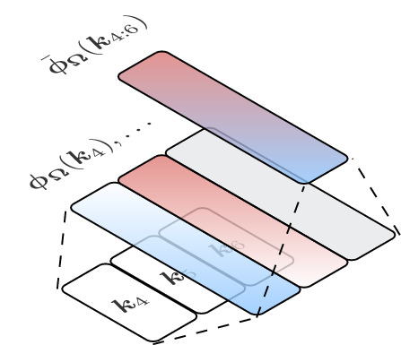
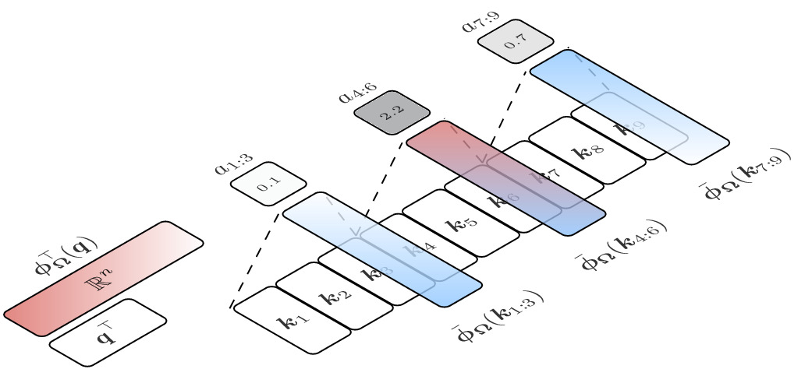
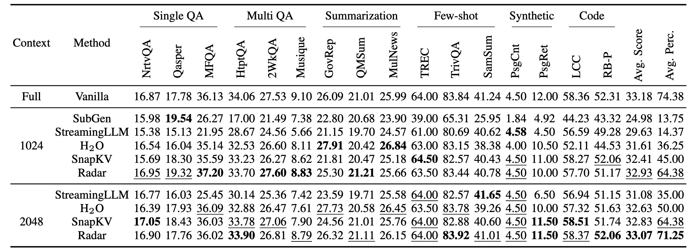

# Radar: Fast Long-Context Decoding for Any Transformer

This is the official repository for the paper [Radar: Fast Long-Context Decoding for Any Transformer](https://openreview.net/forum?id=ZTpWOwMrzQ) at ICLR 2025.
The repository contains the code for the experiments in the paper.


## Basic idea
Radar accelerates Transformer decoding by compressing the context with random projections demonstrated in the figures below.

Build | Query
:---:|:---:
 | 

## Results

Radar achieves state-of-the-art performance on the LongBench benchmark, which measures the decoding speed of Transformers on long sequences.



# Usage

You can use the `radar` package to compress and decompress tensors. Here is an example:

```python
import radar
config = radar.RadarCacheConfig(
    hdim=4096,  # the hidden dimension of the transformer
    projection_dim=4096,  # the projection dimension of each head
    residual_length=1024,  # the length of the sliding window
    num_sink_tokens=1,  # the number of sink tokens
    topk=64,  # the number of top-k segments to keep
)
model = radar.convert_(config, model)
```

# Replicating Experiments

You can replicate all the experiments in the paper by using the files in the [research/](research/) directory. Each file corresponds to one or more experiments in the paper.

# Citation

If you find this project useful, please consider citing our paper as follows:

```bib
@inproceedings{
    hao2025radar,
    title={Radar: Fast Long-Context Decoding for Any Transformer},
    author={Yongchang Hao and Mengyao Zhai and Hossein Hajimirsadeghi and Sepidehsadat Hosseini and Frederick Tung},
    booktitle={The Thirteenth International Conference on Learning Representations},
    year={2025},
    url={https://openreview.net/forum?id=ZTpWOwMrzQ}
}
```